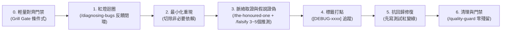

# 科學排查與除錯全自動流水線 (Debug Flow)

本協議為「排查與修復 Bug」的標準調度器。當使用者輸入 `/debug-flow` 或回報系統錯誤時觸發。

---

## 階段 0：輕量症狀與邊界對齊門禁 (Grill Gate - 條件式啟動)

除錯講求速度。若使用者在輸入指令時**已提供完整的報錯 Log 與重現指令，可直接跳過本門禁進入階段一**。
若錯誤症狀模糊、或涉及潛在介面影響時，**快速發起 1~2 個高質量對齊提問**：

> 🔗 **依 `grill-me`（`/grill-me`）協議提問**（格式、每輪上限、事實自查、共識確認皆以該協議為準）。以下是本 flow 的**必問題目**，作為初始決策前線；回答後若衍生新分支再依協議續問。

### 必問題目

1. **Q1 修復邊界**：是否允許修改公開 API 介面或資料庫 Schema？
   - 選項：嚴格不允許（維持向下相容，僅限內部邏輯修復）／ 允許微調（根因出在型別或介面設計缺陷時可適度修正）。
   - 推薦：嚴格不允許，純內部邏輯修復優先。
2. **Q2 期望行為**（僅在無法判斷「正確行為應為何」時才問，否則略過）：發生此問題時，系統應如何表現？
   - 選項：靜默降級並回傳 Fallback 預設值 ／ 明確拋出具體業務例外，方便上層攔截。
   - 推薦：依情境選擇並說明理由。

> ⚠️ **門禁約束**：等待使用者確認（使用者可直接回覆「依推薦」或直接提供重現線索）後，解鎖進入階段一。

---

## 階段一：構造紅燈反饋迴圈 (Phase 1: Build Feedback Loop - `/diagnosing-bugs`)

在動手看業務代碼或下結論前，**必須先找出一條能穩定報紅的驗證命令**：
1. **構建指令**：
   - 失敗的單元/整合測試（最優先）
   - 本地 `curl` 請求或 API 測試腳本
   - 帶有 Mock 參數的 CLI 呼叫
2. **門禁核驗**：在終端實際執行此指令，並將輸出標記為紅燈基準。
   * ⚠️ 找不到穩定報紅指令前，嚴禁猜測修改業務邏輯。
3. **無法穩定重現時的出口**：若嘗試 3 種不同構造方式（測試、請求腳本、CLI）仍無法穩定報紅（偶發、僅限生產環境、依賴外部狀態）：
   - 停止猜測修復，改走**觀測路線**：在關鍵路徑加上帶 `[DEBUG-xxxx]` 標籤的日誌或監控，收集下次發生時的現場資料。
   - 向使用者回報已嘗試的方式與目前證據，由使用者決定是否取得生產日誌或延長觀測，而不是無限卡在本階段。

---

## 階段二：最小化重現環境 (Phase 2: Minimise Repro)

1. 逐一剔除無關變數、外圍中介軟體或次要資料欄位。
2. 確保留下的每一項設定皆為 Bug 觸發之必要條件。
3. 將該最小場景作為後續抗回歸測試的雛形。

---

## 階段三：多元假說與科學證偽 (Phase 3: Hypothesise & Falsify - `/falsify`)

**先取證，再假設**：調度 `/the-honoured-one`，但範圍嚴格限定在「報錯堆疊與最小重現涉及的檔案」及其直接呼叫端／被呼叫端，並以 `git log -p -n 5 -- <檔案>` 檢視近期變更；列出已讀清單與盲點清單。未取證前，嚴禁提出假說。

調度 `/falsify` 提出 3~5 個具體、具排序的可證偽假說：
- 格式：「若原因為 A，則改變條件 B 必導致錯誤消失/加劇」。
- 主動尋找可能推翻該假設的反例或併發競態條件。

---

## 階段四：標籤化打點追蹤 (Phase 4: Targeted Instrument)

1. **唯一標籤**：本次排查開頭產生一組 4～6 碼隨機短 ID（如 `openssl rand -hex 3`），全程共用，所有測試 Log 強制加上 `[DEBUG-<ID>]` 標籤。
2. **單一變數**：一次只印一個變數，嚴禁亂槍打鳥。

---

## 階段五：抗回歸修復 (Phase 5: Fix & Regression Test - `/tdd`)

1. **鎖死測試**：將最小重現場景編寫為抗回歸測試（保持紅燈）。
2. **最小修復**：實作修正代碼，使測試轉為綠燈。
3. **驗證完整性**：重跑階段一的原始完整場景，確認未破壞周邊業務。

---

## 階段六：清理打點與自適應門禁 (Phase 6: Cleanup & Guard - `/quality-guard`)

1. **清除打點**：移除所有 `[DEBUG-<ID>]` 臨時打點，並以 `grep -rn "DEBUG-<ID>" . --exclude-dir=node_modules --exclude-dir=.git` 驗證**回傳 0 筆**後才算完成。
2. **自適應門禁**：調度 `/quality-guard` 檢查 Clean Code，確保無吞掉例外、無殘留假數據。
3. **極簡輸出卡片**：
   - 🐛 **根因說明**：明確指出導致 Bug 的關鍵程式碼與邏輯漏洞
   - 🧪 **抗回歸測試**：列出新增的保護測試路徑
   - 🛠️ **修復檔案**：列出修改檔案清單與 diff 摘要
