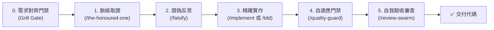

# 開發與重構全自動流水線 (Dev Flow)

本協議為「高品質代碼開發」的標準調度器。當使用者輸入 `/dev-flow` 或提出功能開發、複雜重構需求時，必須嚴格按照以下階段推進，未經需求對齊前禁止盲目動手。

---

## 階段 0：需求對齊拷問門禁 (Grill Gate)

在調度 `/the-honoured-one` 掃描代碼前，**必須先啟動一輪結構化需求拷問**，確保功能邊界與驗收標準（DoD）100% 達成共識。

> 🔗 **封包入口**：若輸入帶有 `refactor-planner` 產出的封包 ID（如 `/dev-flow WP-01-AUTH-INTERFACE`），以封包內容直接作為答案——「所有權檔案」即範圍與 Out of Scope、「不變量」即邊界、「驗收檢查指令」即 DoD。此時**僅需確認 Q1**，其餘提問略過。

> 🔗 **依 `grill-me`（`/grill-me`）協議提問**（格式、每輪上限、事實自查、共識確認皆以該協議為準）。以下是本 flow 的**必問題目**，作為初始決策前線；回答後若衍生新分支再依協議續問。

### 必問題目

1. **Q1 實作策略**：TDD（先寫紅燈測試再實作）／ 一般實作（遵循現有架構，增量開發與測試）。
   - 推薦：專案已有測試框架且該模組有測試 → TDD，否則 → 一般實作。測試框架有無由 AI 自查，回覆時說明判斷依據。
2. **Q2 非目標（Out of Scope）**：本次絕對不修改的範圍。
   - 推薦：列出具體邊界，如「僅限資料層，不更動前端 UI」。
3. **Q3 驗收條件（DoD）**：完成後的 1～2 項可驗證行為。

> ⚠️ **門禁約束**：等待使用者確認（可直接回覆「依推薦」或修改個別選項）後，方可進入階段一。

---

## 階段一：全域脈絡取證 (Context Audit - `/the-honoured-one`)

消滅所有未讀盲點與猜測，贏得編程權利：
1. **依賴與邊界清點**：
   - 找出即將被修改或引用之檔案的上下游（呼叫端、被呼叫端、型別定義）。
2. **上下文完整性核對**：
   - 列出關聯檔案清單與盲點清單，未完整讀取前絕對禁止草擬程式碼。

---

## 階段二：假設與方案證偽 (Hypothesis & Falsification - `/falsify`)

在敲下第一行代碼前，主動嘗試推翻自己的設計：
1. **反例自問（Attempt to Break It）**：
   - 「在極端輸入、網路延遲或高併發競態條件（Race Condition）下，這個解法會崩潰嗎？」
   - 「是否破壞了既有公開 API 的向下相容性？」
2. **消除過度設計**：
   - 確保方案遵循現有專案架構模式，不重複造輪子。

---

## 階段三：規格精確實作 (Implementation - `/implement` / `/tdd` / `/swarm-executor`)

執行代碼修改，嚴守最小且精確變更：
1. **規模分流與調度模式**：
   - 🔹 **小型/局部變更（≤ 4 個檔案，且限於單一模組）**：
     - 若階段 0 選定 TDD：先編寫失敗測試，再編寫最小實作至通過（`/tdd`）。
     - 若為一般實作：禁止憑空加戲，依據規格最小增量實作（`/implement`）。
   - 🚀 **中大型/跨模組變更（≥ 5 個檔案，或跨 2 個以上獨立模組）**：
     - 判斷以「能否劃分出互不重疊的檔案所有權」為準；邊界案例（如 4 個檔案但跨模組）依本條歸類，使用者亦可直接指定模式。
     - 調度 **`/swarm-executor`（蜂群執行者）**，建立檔案互斥鎖（File Mutex），派遣多個 Worker Subagents 並行施工與就地單元驗收，零衝突交付。
2. **代碼完整性**：
   - 嚴禁留下 `// TODO: implement later`、`... existing code ...` 或未完成佔位符。

---

## 階段四：自適應品質門禁 (Self-Check Gate - `/quality-guard`)

在結束實作前，強制執行 Clean Code 自我檢查與修正：
1. **三項核心阻斷門禁（Zero Tolerance）**：
   - ❌ **禁止吞掉例外**：嚴禁空白 catch。
   - ❌ **禁止殘留假數據與 Debug 打點**：清除所有臨時 log 與 mock 資料。
   - ❌ **禁止破壞現有測試**：執行測試套件確保無回歸。
2. **自我修復**：發現違規即刻原地修正。

---

## 階段五：自閉環審查與交付 (Self-Review - `/review-swarm`)

交付前自動調度 `/review-swarm`（四維度審查）對當前 git diff 進行唯讀掃描。**Clean Code 與壞味道已於階段四完成，本階段不重複檢查**，僅聚焦行為回歸、資安隱私、效能可靠性、測試覆蓋四維度，並輸出極簡報告：
- 🔍 **變更摘要**：修改的檔案清單與關鍵更動
- 🛡️ **門禁檢驗**：引用階段四的 Clean Code 結果，加上階段五四維度審查結論
- 🚀 **下一步行動**：確認是否準備提交（Commit）或發起 PR
