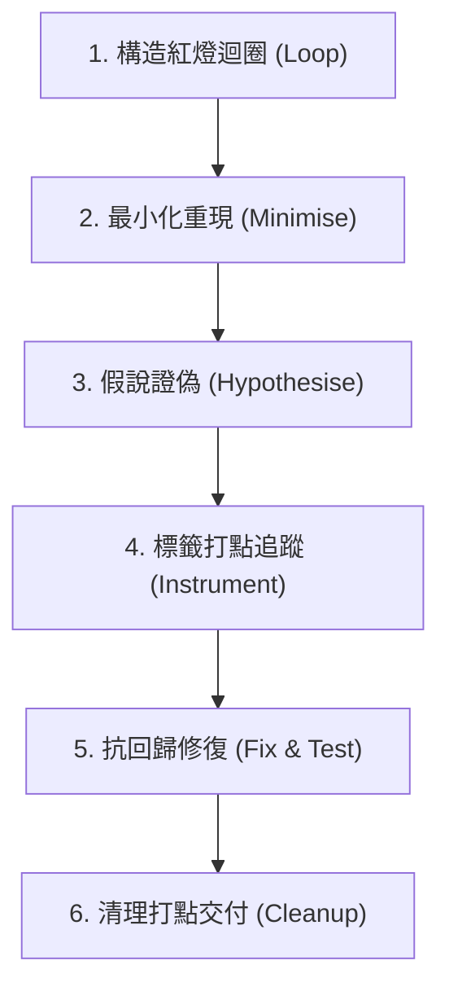

# Diagnosing Bugs（科學排查與除錯協議）

> 「無紅燈指令，不准通靈看 Code；沒有可證偽的假說，一切推論都是瞎猜。」

本協議改寫自 Matt Pocock 之工程標準，旨在杜絕 AI 在排查 Bug 時最嚴重的死循環：**在沒有穩定重現命令的情況下，死盯著代碼胡亂猜測與試錯修復**。

---

## 鐵律（The Iron Law of Debugging）

```text
NO FEEDBACK LOOP, NO HYPOTHESIS.
沒有可穩定報紅的反饋迴圈，絕對禁止建立假說或修改業務代碼。
```

---

## 核心六階除錯循環



### 階段一：構造緊湊的紅燈反饋迴圈 (Phase 1: Build a Feedback Loop)
**這是除錯的核心本質。** 必須先找到或建立**一條命令**（幾秒內跑完、百分之百報紅、AI 可自動執行），用來檢測此 Bug：
1. **優先順序**：
   - 失敗的單元/整合測試（最推薦）
   - 對本地開發伺服器的 `curl` / HTTP 請求腳本
   - 帶有 Mock 資料的 CLI 腳本呼叫並 diff 輸出
   - Headless 瀏覽器腳本（Playwright / Puppeteer）
2. **緊湊度要求**：
   - 必須精確抓出該 Bug 的特定錯誤訊息或異常行為（非單純「沒有 crash」）。
   - 執行時間以秒為單位，絕不依賴分鐘級的厚重流程。
3. **偶發/隨機 Bug (Flaky Bugs)**：
   - 不追求一次乾淨重現，而是提高觸發機率（跑 100 次迴圈、並行高壓、縮小 timing 窗口），直到能穩定捕捉。

> ⚠️ **門禁確認**：未能在終端執行出一條**已親自跑過且確定報紅的具體指令**前，**嚴禁進入階段二**。

---

### 階段二：最小化重現環境 (Phase 2: Reproduce & Minimise)
縮小重現範例至**最小可行場景**：
- 逐一剔除不相干的輸入、設定檔、呼叫端與外圍依賴，每砍掉一項就重跑一次階段一的迴圈。
- **完成標準**：剩下的每一行代碼或資料都是該 Bug 觸發的必要條件（只要再砍掉任何一項，測試就會變綠）。
- 目的：大幅縮小疑犯範圍，並直接作為後續抗回歸測試的黃金樣本。

---

### 階段三：提出 3~5 個可證偽假說 (Phase 3: Hypothesise)
**嚴禁只鎖定單一猜測！** 單一假設容易讓人陷入確認偏誤（Confirmation Bias）。
- 提出 3~5 個具體、具排序的假說。
- 每個假說必須符合證偽格式：
  > 「如果原因為 <原因 X>，那麼只要修改 <變數 Y>，該錯誤就會消失；或者調整 <參數 Z>，錯誤就會惡化。」
- 若寫不出上述預測，該假說即為無效瞎猜，立即捨棄。

---

### 階段四：標籤化打點追蹤 (Phase 4: Targeted Instrument)
一次只驗證一個變數，絕不漫無目的 console.log：
1. **打點標籤鐵律**：
   - 所有暫時加入的 debug log 必須帶有唯一隨機前綴標籤，例如 `[DEBUG-c8d1]`。
   - 格式：`console.log('[DEBUG-c8d1] current state:', state)`。
2. **驗證假說**：
   - 透過標籤輸出檢驗階段三的預測是否成立。
   - 性能問題優先建立 baseline 測量（如 `performance.now()`），而非印 log。

---

### 階段五：抗回歸修復 (Phase 5: Fix & Regression Test)
1. **抗回歸測試先行**：將階段二最小化的重現範例正式轉為單元或整合測試（先紅燈）。
2. **實作修復**：編寫最小且精確的修正代碼。
3. **綠燈確認**：觀察測試轉綠，並重跑階段一的完整情境驗證徹底修復。

---

### 階段六：清理打點與交付 (Phase 6: Cleanup)
在回報修復完成前，強制執行清理檢查：
- [ ] 原始紅燈反饋迴圈已確定通過。
- [ ] 抗回歸測試納入測試套件。
- [ ] 使用 `grep -r "\[DEBUG-"` 清理所有臨時打點標籤，零殘留。
- [ ] 於 Commit / PR 訊息中清楚說明根因與證偽過程，傳承知識。
