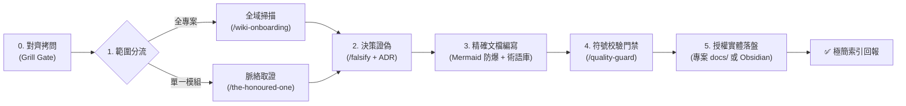

# 架構解析與技術文件全自動流水線 (Doc Flow)

本協議為「高品質技術文檔與架構梳理」的標準調度器。當使用者輸入 `/doc-flow` 或要求產出專案架構文件、模組導覽、Onboarding Guide 時，必須嚴格按照以下六個階段推進，未經使用者確認前禁止自作主張落盤寫檔。

> 📂 **路徑變數**：`$OBSIDIAN_VAULT` 讀取環境變數。**未設定且使用者未提及筆記庫時，視為不使用 Obsidian：不得提供 Obsidian 落盤選項，也不得猜測或建立目錄。**使用者主動指定筆記庫路徑時以該路徑為準。



---

## 階段 0：需求對齊拷問門禁 (Grill Gate)

在進行任何代碼掃描或文檔產出前，**必須先啟動一輪結構化需求拷問**，確保產出的內容 100% 符合使用者預期。

### 提問鐵律
1. **遵循 `grill-me` 提問規範**：每題附推薦答案、事實自查、決策才問（詳見下方連結區塊）。
2. **強制確認存放位置**：主動提供專案內、Obsidian 筆記庫或純終端展示選項，**未經使用者確認授權前，絕對禁止在磁碟建立或修改任何檔案**。

> 🔗 **依 `grill-me`（`/grill-me`）協議提問**（格式、每輪上限、事實自查、共識確認皆以該協議為準）。以下是本 flow 的**必問題目**，作為初始決策前線；回答後若衍生新分支再依協議續問。

### 必問題目

1. **Q1 受眾與深度**：
   - 選項：新人／協同開發者（接手、環境準備、踩坑）／ 架構師／技術決策者（為什麼這樣設計、資料流向、ADR）／ API 串接端（介面契約、型別、錯誤處理）。
   - 推薦：使用者是接手者 → 新人；問「為什麼這樣設計」→ 架構師；對外 API 文件 → API 串接端；不確定 → 新人。
2. **Q2 存放位置**（授權門禁：未確認前不得寫入任何檔案）：
   - 選項：專案內 `docs/architecture/<module>.md` 或 `docs/specs/<feature>.md` ／ `$OBSIDIAN_VAULT/專案架構/<module>.md` ／ 僅在終端展示。
   - **Obsidian 選項僅在 `$OBSIDIAN_VAULT` 已設定或使用者提及筆記庫時才列出**，否則只提供「專案內」與「僅終端」。
   - 推薦：在專案目錄內 → 專案內；使用者提到筆記庫 → Obsidian；只詢問不要求存檔 → 僅終端。
3. **Q3 聚焦範圍**：要深入的關鍵流程，或想排除的次要細節。
   - 推薦：由 AI 先掃描目錄結構，再提出明確具體的建議範圍。

> ⚠️ **門禁約束**：等待使用者回覆確認（使用者可回「全部依推薦」或修改個別選項）後，方可解鎖進入階段一。

---

## 階段一：情境範圍分流 (Scope Routing)

依據階段 0 確認的目標範圍，精準調度對應取證工具，杜絕「殺雞用牛刀」：

### 情況 A：全專案導覽（Global Onboarding）
- **觸發條件**：使用者接手新專案、要求產出整體架構概覽或新手入門手冊。
- 🧭 **專案一次讀不完**（有 3 個以上獨立服務或套件、跨模組流程難以追蹤，或尚無 L0 全景圖）：先呼叫 `/doc-scope` 取得本次範圍與完成標準，再以該範圍進入後續階段。
- **規模分流與多代理探勘（Parallel Research Swarm）**：
  - 🔹 **小型專案（單一模組、目錄簡潔）**：調度 `/wiki-onboarding` 進行巨觀掃描，產出「架構師視角」與「新人上手視角」雙指南。
  - 🚀 **中大型專案（Monorepo、全端或目錄層級深）**：**啟動多代理並行探勘**。主控架構師透過 `invoke_subagent` 派遣 2~3 個專門的 `research` 子代理分頭探勘：
    1. **探勘兵 A（UI 與視圖層）**：路由定義、State Store、主要視圖與元件階層。
    2. **探勘兵 B（業務與 API 層）**：API Client、資料模型、核心業務領域邏輯。
    3. **探勘兵 C（基建與配置層）**：依賴套件、建置設定 (Vite/Webpack)、CI/CD 與環境變數規範。
    各探勘兵回報模組摘要後，主控架構師收斂全貌並統一編寫 Onboarding 全覽指南。

> ⚙️ **降級規則**：若當前 CLI 不支援 `invoke_subagent`（或同類子代理機制），改為**單線依序執行**——逐組探勘／逐維度審查，每組結論先存成暫存檔或貼在對話中，最後由主控彙整。結論品質不變，僅速度較慢。

### 情況 B：單一模組 / 功能規格（Feature / Module Spec）
- **觸發條件**：針對特定目錄、特定業務流程、API 設計或重構現狀梳理。
- **調度技能**：調度 `/the-honoured-one`（全域脈絡取證協議），建立上下游關聯檔案清單，消除未讀盲點，精準聚焦於該模組。

---

## 階段二：假設與決策證偽 (Falsification - `/falsify`)

在正式撰寫文檔前，主動質疑對代碼的初步理解，並沉澱為架構決策背景（ADR Context）：

1. **質疑通靈假設**：
   - 「這段流程真的是這樣串接的嗎？有沒有中間件（Middleware）或攔截器偷偷修改了狀態？」
   - 「這個型別或設定是否在 runtime 被覆蓋或動態注入？」
2. **沉澱 ADR 決策脈絡（Why）**：
   - 記錄「為什麼現有系統採用方案 A 而非方案 B？」
   - 記錄此設計所做出的妥協（Trade-offs）與適用邊界（例如在高併發或極端邊界下的表現）。

---

## 階段三：技術文檔精確編寫 (Document Crafting)

依據真實代碼編寫 Markdown 文檔，必須落實以下標準骨架與防爆規範：

### 0. 檔案標頭與 Metadata 規範（目標感知）
- **當儲存目標為 Obsidian 知識庫時**：
  - **強制對齊範本**：優先繼承筆記庫內 `Template/統一筆記範本.md`（若存在），否則採用下列標準結構，在文檔頂部注入標準 YAML Frontmatter：
    ```yaml
    ---
    title: "<模組/文件名稱>"
    description: "<一句話核心職責與定位摘要>"
    tags:
      - architecture/<專案或領域名稱>
    created: YYYY-MM-DD
    updated: YYYY-MM-DD
    aliases:
      - <英文模組名稱或縮寫>
    status: completed
    ---
    ```
  - **建立與修訂日期規範（Lifecycle Dates）**：
    - **新建檔案**：`created` 與 `updated` 皆填入建立當天日期 (`YYYY-MM-DD`)。
    - **修訂既有檔案**：**嚴禁覆寫原始 `created` 日期**，必須保留初始時間戳，並強制將 `updated` 自動更新為當天修訂日期 (`YYYY-MM-DD`)。
  - **核心定位標註**：文檔一級標題下方統一使用 `> [!NOTE] 核心定位` 標註框。
  - **語意雙鏈契約（寧缺毋濫原則）**：
    - 文檔結尾設置 `## 相關筆記與參考資源`，主動檢索庫內現有文檔，**僅在存在真實技術依賴、架構上下游或同一專案/領域 MOC 時**才以 `[[WikiLink]]` 串聯。
    - **找不到關聯，就保持獨立**：若該主題為全新獨立領域或無直接架構依賴，**嚴禁為了打破孤島而強行拉郎配（如硬塞不相干的快捷鍵或通用語法筆記）**；應明確標註為獨立單元（如 `*(本篇為獨立模組，暫無直接依賴之子模組)*`），並依靠精確的階層標籤（`tags`）進行分類管理。
- **當儲存目標為專案目錄 (`docs/...`) 或終端展示時**：
  - 產出標準 Markdown，確保標題層級與語法之跨平台簡潔相容。

### 1. 標準文檔五大骨架
* **【模組定位】**：用 1~2 句話直指該模組的核心職責與系統邊界。
* **【領域術語庫 (Domain Glossary)】**：記錄該模組獨有的業務概念與專門黑話，統一語言（Ubiquitous Language），杜絕認知落差。
* **【核心介面與契約】**：列出關鍵 Class、Interface 或資料結構型別。
* **【視覺化架構/時序圖】**：透過圖表直觀呈現模組關係或資料生命週期。
* **【邊界與異常處理】**：記錄失敗重試、邊界條件與潛在技術債。

### 2. 🛡️ Mermaid 架構圖語法防爆鐵律（Zero-Error Rules）
* **節點標籤強制雙引號包裹**：任何含括號、斜線、冒號、空格等符號，一律雙引號包裹：`node["使用者服務 (User Service)"]`。
* **嚴禁保留字作為節點 ID**：禁止直接使用 `end`、`subgraph` 作為節點名稱，改用 `step_end["結束"]`。
* **連線標籤規範化**：一律採用 `-->|"標籤內容"|` 格式。

### 3. 行內代碼取證
* 關鍵論點與實作細節必須附帶真實程式碼行號引用，例如 `(src/auth/jwt.ts:42)`。

---

## 階段四：自適應文檔門禁 (Docs Guard - `/quality-guard`)

在文檔產出後，必須在交付前進行自動真實性核實：
1. **符號與路徑真實性（Symbol Verification）**：
   - 文檔中提及的所有函式、變數、介面名稱，是否 100% 在代碼庫真實存在？
   - 檔案路徑與副檔名是否完全正確？杜絕幽靈 API。
2. **範例代碼可執行性**：
   - 語法是否合規？引用路徑是否可正確 import？
3. **Obsidian 規範與雙鏈真實性核實（若落盤目標為 Obsidian）**：
   - 是否具備完整標準 Frontmatter（`title`, `description`, `tags`, `created`, `updated`, `status`）？
   - **生命週期日期核實**：若目標檔案已存在，驗證 `created` 是否完整保留原始建立日期，且 `updated` 是否已成功更新為當日修訂日期。
   - **雙鏈真實性檢驗**：若有 `[[WikiLink]]`，驗證其是否具備實質架構脈絡，**嚴禁硬塞無關之基礎配置筆記**；若無直接關聯，驗證是否已合理宣告獨立狀態與標籤，杜絕虛構連結。
4. **自我修正**：若發現任何虛構符號、路徑錯誤、無效連結或格式缺失，立即原地修正後才推進。


---

## 階段五：授權實體落盤與極簡回報 (Persistence & Reporting)

### 1. 實體檔案落盤
* 嚴格依據**階段 0 使用者所選擇或確認的位置**將完整文檔寫入磁碟：
  - 專案目錄：`docs/architecture/<module>.md` 或 `docs/specs/<feature>.md`
  - Obsidian 知識庫：`$OBSIDIAN_VAULT/專案架構/<module>.md`
  - 若使用者選擇「純終端展示」，則略過磁碟寫入。

### 2. 對話框極簡回報（索引卡）
**嚴禁在終端對話視窗全文輸出數千字刷屏**，僅輸出以下結構化卡片：
- 🧭 **模組職責**：一句話架構定位
- 📊 **核心圖解**：內嵌 Mermaid 架構/流程圖
- 📂 **文檔檔案**：提供已儲存檔案的本機可點擊連結 `file:///...`
- 🛡️ **真實性校驗**：標註通過 `/quality-guard` 檢驗之符號與行號引用證明
