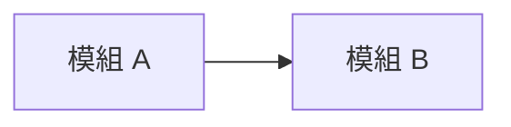

# L0 全景圖：<專案名稱>

> 最後更新：YYYY-MM-DD ｜ 產出者：doc-scope ｜ 狀態：草稿 / 已確認
> 上層 L0：<[[上層 L0 連結]]，根目錄 L0 留空>

## 1. 系統用途
<一到兩句話：這個系統為誰解決什麼問題>
- 來源：`README.md` 等檔案路徑（找不到就寫「待確認」）

## 2. 技術棧
| 類別 | 技術 | 來源 |
|---|---|---|
| 語言 | | `package.json` |
| 框架 | | |
| 資料庫 / 快取 | | |
| 建置 / 部署 | | |

## 3. 模組清單
| 模組 | 路徑 | 一句話職責 | 來源 |
|---|---|---|---|
| | `apps/xxx` | | `apps/xxx/README.md` |

## 4. 依賴方向

- 圖中每條箭頭都要有 import 或設定檔當證據；沒證據的標「待確認」。

## 5. 外部整合
| 對象 | 用途 | 來源 |
|---|---|---|
| 第三方 API / 服務 | | |

- 對象若是自己的另一個專案，對象欄標註「內部專案：<專案名稱>」（日後收攏產品層時用來串接）。

## 6. 優先順序（來自四問排序，最多 5 列）
| 排名 | 模組 | Q1 近期要改 | Q2 出事會痛 | Q3 知識孤島 | Q4 變動頻繁 |
|---|---|---|---|---|---|
| 1 | | 是（使用者確認） | | | |

- 統計區間：近 6 個月 ｜ 無統計資料時填「無統計資料」，不填數字

## 7. 文件覆蓋狀態（步驟 6 回寫用）
| 模組 | 狀態 | L1 連結 | L2 連結 | 最後更新日 |
|---|---|---|---|---|
| | 未寫 / 進行中 / 已完成 | | | YYYY-MM-DD |

## 8. 待確認事項
- [ ] <AI 無法從程式碼判斷、需要人回答的問題>
