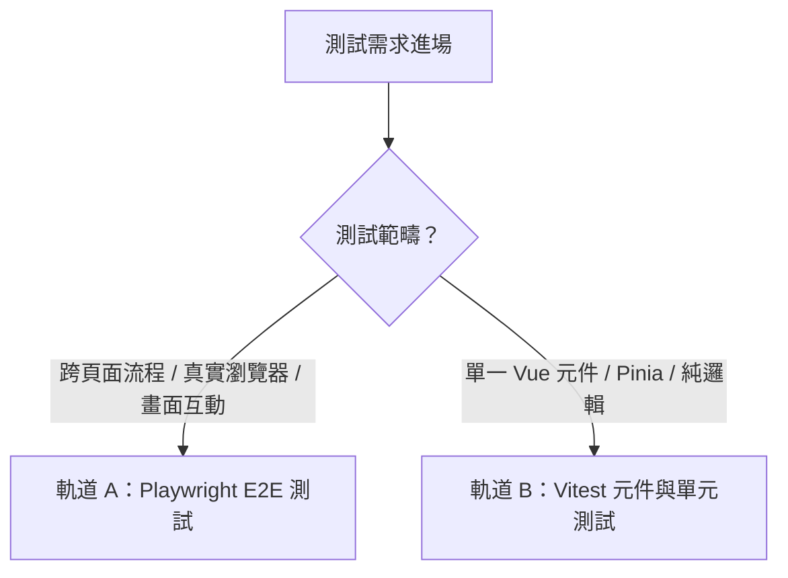

# 現代前端測試專家協議 (Frontend Tester: E2E & Component)

本協議為「現代前端自動化測試」的最高實踐標準。專門解決前端工程師在畫面互動、非同步渲染、元件狀態與跨頁面流程中的測試痛點。

## 觸發時機與快捷指令
- 快捷指令：**`/frontend-tester`**
- **E2E 需求**：撰寫或除錯 Playwright 端到端測試、模擬使用者多步驟操作、測試表單與路由。
- **元件測試需求**：使用 Vitest + Vue Test Utils 測試 Vue 3 SFC 元件、Pinia 狀態、Props 與 Emits。
- **不穩定測試修復**：排查畫面點不到、過早斷言、網路競爭等 Flaky Tests。

---

## 雙軌自適應架構 (Dual-Track Testing)

依據測試目標自動切換至對應軌道：



---

## 軌道 A：Playwright E2E 測試（畫面與使用者旅程）

專門驗證瀏覽器真實渲染、使用者旅程（User Journey）與前端與 API 的整合。

### 1. 穩定定位器鐵律（Resilient Locators）
- ❌ **嚴禁脆弱定位**：禁止使用 `div > button:nth-child(2)`、隨機 CSS class（如 `.btn-primary-2x`）或 XPath。
- ✅ **強制使用無障礙與語意定位（Accessibility-first）**：
  ```typescript
  // 最佳優先級：
  page.getByRole('button', { name: '確認送出' })
  page.getByLabel('使用者帳號')
  page.getByPlaceholder('請輸入電子信箱')
  page.getByText('登入成功')
  // 僅在無任何語意屬性時使用專用測試 ID：
  page.getByTestId('cart-checkout-btn')
  ```

### 2. 徹底杜絕 Flaky 的自動等待（Web-First Assertions）
- ❌ **絕對禁止硬編碼死等**：嚴禁 `await page.waitForTimeout(3000)`。這是造成測試在不同機器或 CI 隨機失敗的罪魁禍首。
- ✅ **強制採用具備自動重試（Auto-retry）的 Web-First 斷言**：
  ```typescript
  await expect(page.getByRole('alert')).toBeVisible();
  await expect(page.getByRole('button', { name: '送出' })).toBeEnabled();
  await expect(page.getByTestId('cart-count')).toHaveText('3');
  ```

### 3. 前端獨立性：網路請求攔截與 Mock（Network Interception）
不依賴後端真實環境，利用 `page.route` 模擬各種極端邊界：
```typescript
// 模擬正常回傳
await page.route('/api/v1/user/profile', async (route) => {
  await route.fulfill({
    status: 200,
    contentType: 'application/json',
    body: JSON.stringify({ name: 'Jerry', role: 'admin' }),
  });
});

// 模擬伺服器崩潰 (500 Error) 測試前端錯誤邊界處理
await page.route('/api/v1/checkout', async (route) => {
  await route.fulfill({ status: 500, body: 'Internal Server Error' });
});
```

### 4. Page Object Model (POM) 規範
將頁面操作與元素封裝成獨立類別，當 UI 佈局微調時，僅需修改 POM，無需改動業務測試案例：
```typescript
// pages/LoginPage.ts
export class LoginPage {
  constructor(private page: Page) {}
  
  readonly usernameInput = this.page.getByLabel('帳號');
  readonly passwordInput = this.page.getByLabel('密碼');
  readonly submitButton = this.page.getByRole('button', { name: '登入' });
  readonly errorMessage = this.page.getByRole('alert');

  async goto() { await this.page.goto('/login'); }
  async login(user: string, pass: string) {
    await this.usernameInput.fill(user);
    await this.passwordInput.fill(pass);
    await this.submitButton.click();
  }
}
```

---

## 軌道 B：Vitest + Vue Test Utils 元件測試（DOM 與響應式）

專門驗證 Vue 3 SFC 元件的隔離渲染、Props、Emits 與 Pinia 狀態。

### 1. 元件掛載與依賴注入（Mounting & Plugins）
```typescript
import { mount } from '@vue/test-utils';
import { createTestingPinia } from '@pinia/testing';
import { describe, it, expect, vi } from 'vitest';
import UserCard from './UserCard.vue';

describe('UserCard.vue', () => {
  it('正確渲染 Props 並觸發自訂事件', async () => {
    const wrapper = mount(UserCard, {
      props: {
        userName: 'Jerry',
        isVip: true,
      },
      global: {
        plugins: [createTestingPinia({ createSpy: vi.fn })],
      },
    });

    // 驗證 DOM 渲染
    expect(wrapper.find('[data-testid="user-title"]').text()).toContain('Jerry');
    expect(wrapper.find('.vip-badge').exists()).toBe(true);

    // 觸發使用者點擊並等待 Vue 響應式週期
    await wrapper.find('button.follow-btn').trigger('click');

    // 斷言 emit 事件
    expect(wrapper.emitted('follow')).toHaveLength(1);
    expect(wrapper.emitted('follow')![0]).toEqual(['Jerry']);
  });
});
```

### 2. 元件測試的核心準則
- **測試公開契約，不測私有細節**：透過使用者看到的文字與觸發的事件斷言，嚴禁深入存取 `wrapper.vm` 的私有變數。
- **異步渲染必須等待**：點擊或改變 props 後，必須搭配 `await wrapper.trigger()` 或 `await nextTick()`，等待 DOM 完成更新。

---

## 前端測試反模式速查表 (Anti-Patterns)

| 劣質寫法 (Bad) | 規範寫法 (Good) | 原因 |
| :--- | :--- | :--- |
| `await page.waitForTimeout(2000)` | `await expect(el).toBeVisible()` | 死等會拖慢測試，且在慢速 CI 上依然會隨機報錯。 |
| `page.click('.btn-submit')` | `await page.getByRole('button', { name: '送出' }).click()` | CSS Class 容易因樣式重構變更，語意屬性最穩定。 |
| `wrapper.vm.count = 5` | `await wrapper.find('button.inc').trigger('click')` | 直接竄改內部狀態破壞真實性，應模擬使用者行為。 |
| 跨測試共用全域可變狀態 | 每個測試在 `beforeEach` 重設 Store / Page | 測試之間未隔離會產生前後相依的難解幽靈 Bug。 |
