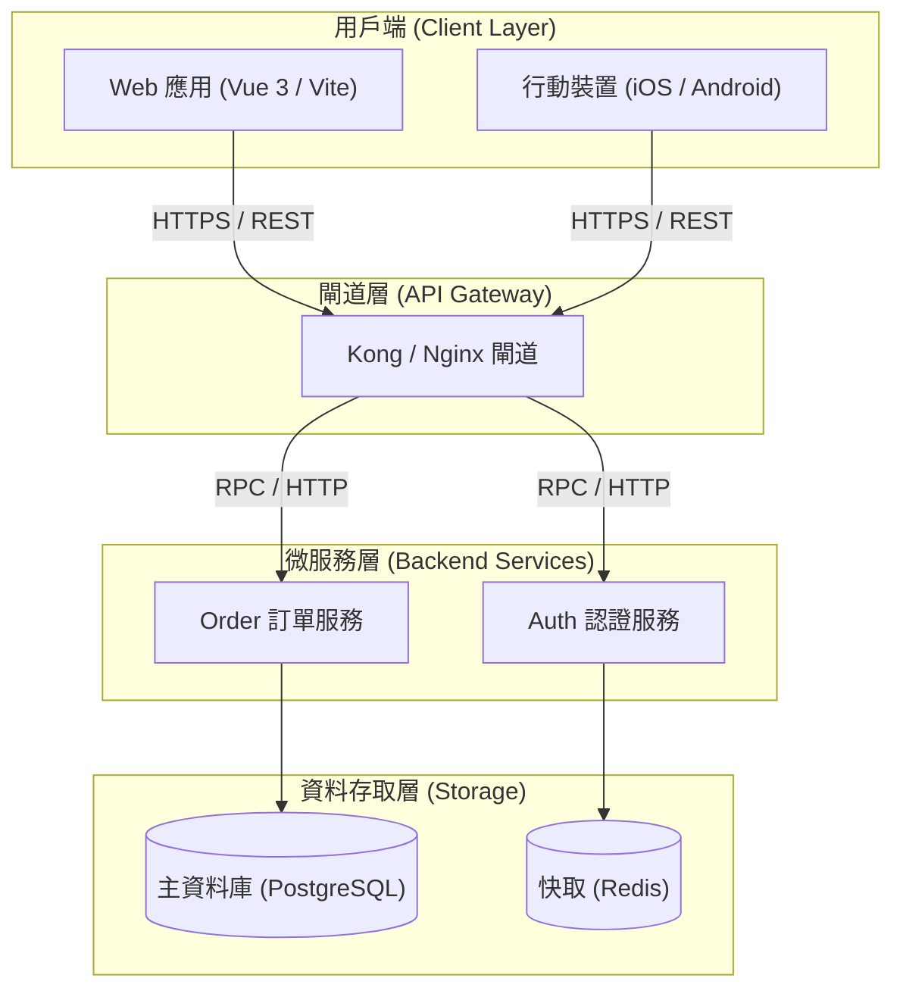
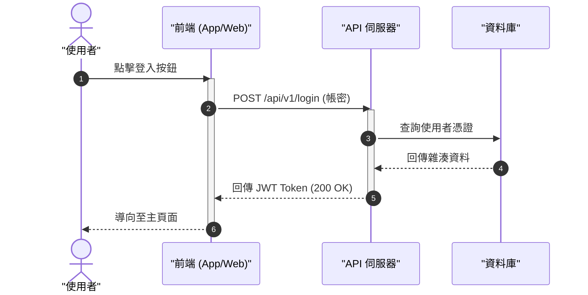

# Mermaid 圖表專家與語法修復協議 (Mermaid Expert & Fixer)

本技能為專業 Mermaid 圖表生成、審查與修復協議。提供「語法零錯誤保證」並能自動診斷與修正報錯的 Mermaid 代碼。

## 觸發時機與指令
- 快捷指令：`/mermaid-expert`
- 使用者要求繪製架構圖、流程圖、時序圖、狀態圖或 ER 圖
- 使用者貼上報錯的 Mermaid 代碼要求修復（「這張圖 render 不出來」、「幫我修復 Mermaid 語法」）

---

## 核心能力一：Mermaid 語法錯誤自動診斷與修復 (Auto-Fixer)

當收到報錯或渲染失敗的 Mermaid 代碼時，按以下 6 大常見病灶進行精準修復：

| 病灶類型 | 常見報錯寫法 | 修正後標準語法 | 修復原因 |
| :--- | :--- | :--- | :--- |
| **1. 括號與特殊字元未引號** | `A[登入模組 (JWT)]` | `A["登入模組 (JWT)"]` | 括號會被解析器視為圓角節點符號，導致語法衝突。強制所有包含括號、空格、符號的文字以雙引號包裹。 |
| **2. 保留字關鍵字衝突** | `start --> end` | `node_start["開始"] --> node_end["結束"]` | `end` 為區塊結束關鍵字，不可作為節點 ID。 |
| **3. Subgraph 格式錯誤** | `subgraph User Module` | `subgraph UserModule ["User Module"] ... end` | 子圖命名含空格且無獨立 ID 會引發解析器中斷。 |
| **4. 連線標籤格式混淆** | `A -- 請求(JSON) --> B` | `A -->|"請求(JSON)"| B` | 標籤採用標準垂直線 `\|"..."\|` 包裹，避免與連線語法打架。 |
| **5. 資料庫圓柱圖符號** | `DB[(資料庫 (PostgreSQL))]` | `DB[("資料庫 (PostgreSQL)")]` | 圓柱圖符號 `[("...")]` 內部文字同樣必須加引號。 |
| **6. 混用非法 HTML** | `A[標題<br/>說明]` | `A["標題\n說明"]` 或 `A["標題 - 說明"]` | 部分 Markdown 渲染器將 raw HTML 視為未封閉標籤。 |

### 修復輸出格式
1. **診斷說明**：一句話指出原始語法的問題點（如：「節點 `A` 中包含中文括號但未以雙引號包裹」）。
2. **修復後代碼**：直接輸出可 100% 成功渲染的 ````mermaid```` 程式碼塊。

---

## 核心能力二：高品質圖表設計規範 (Design Patterns)

在主動設計圖表時，遵循以下最高相容性模式：

### 1. 系統架構流程圖 (Flowchart)


### 2. 時序圖 (Sequence Diagram)
- 一律明確宣告 `autonumber`
- 一律宣告參與者 `participant` 或 `actor`，避免隱式產生未定義角色
- 善用 `activate` / `deactivate` 標註生命週期



---

## 驗證門禁檢查清單（交卷前自檢）
- [ ] 所有節點名稱、連線標籤中若含括號 `()`、斜線 `/`、空格，是否均以雙引號 `["..."]` 包裹？
- [ ] 是否完全不存在 `end`、`graph`、`style` 作為 node id？
- [ ] 所有的 `subgraph` 是否都有配對的 `end`？
- [ ] 圖表類型是否為標準支援白名單（`flowchart TD/LR`、`sequenceDiagram`、`classDiagram`、`erDiagram`、`stateDiagram-v2`）？
