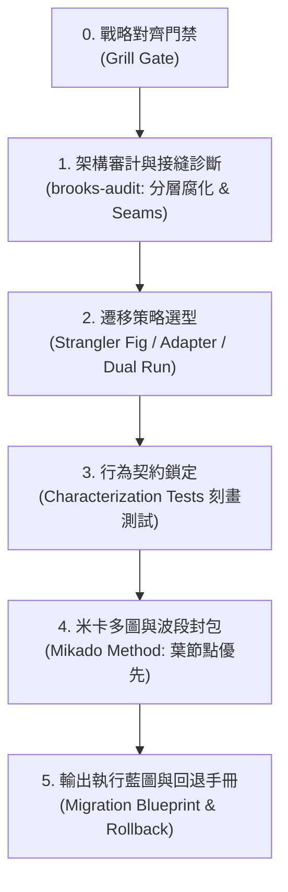
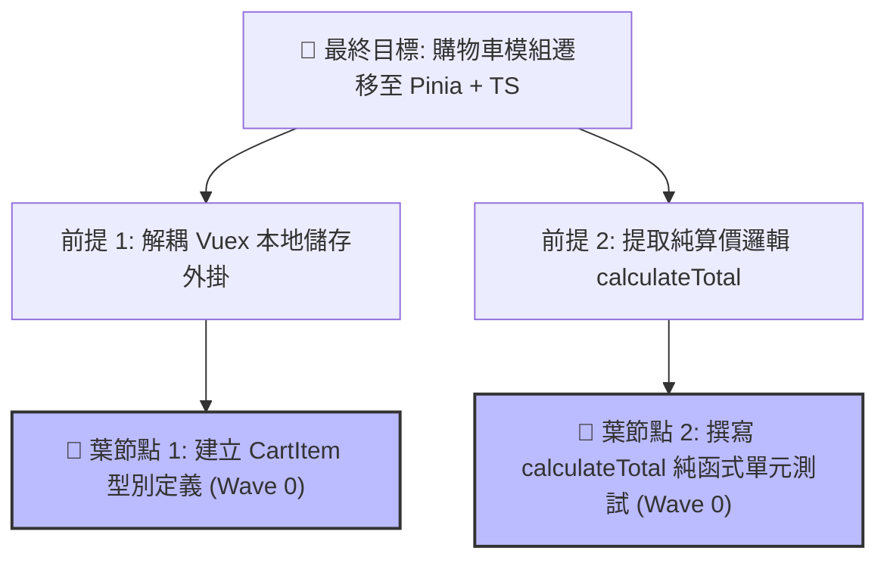

# 大型重構與架構規劃流水線 (Refactor Planning Flow)

本協議為「大型程式碼重構」與「跨框架／跨語言技術遷移」的專業架構規劃流程 (Planning Flow)。深度融合：
1. **`brooks-audit`**（經典名著架構審計：分層腐化與測試接縫）
2. **`The Mikado Method`**（米卡多圖論：葉節點優先、即時 Revert、主幹永遠可發布）
3. **`Strangler Fig Pattern`**（絞殺者模式：新舊系統漸進式雙軌共存）
4. **`Work Packets`**（依賴感知任務封包：單一檔案所有權、5 分鐘 Rollback 保證）

杜絕「一次改太大導致系統癱瘓、無法上線、無法回退」的大爆炸（Big Bang）悲劇。

## 觸發時機與快捷指令
- 快捷指令：**`/refactor-planner`**
- 跨語言轉換（如 JavaScript ➔ TypeScript、Python ➔ Go / Rust）
- 跨框架升級與重構（如 Vue 2 ➔ Vue 3、React ➔ Vue、Options API ➔ Composition API、Express ➔ NestJS）
- 架構範式轉移（如 Monolith ➔ Modular Monolith / FSD 分層架構、巨型 Controller/元件解耦）
- 大規模批次重構（涉及跨子系統、數十個檔案的依賴梳理）

---

## 核心規劃流程 (The Migration Workflow)

---

## 階段 0：重構戰略對齊門禁 (Grill Gate)

在啟動架構審計與分析前，**必須先啟動一輪結構化需求拷問**，確保重構目標、風險承受度與邊界 100% 達成共識。

> 🔗 **依 `grill-me`（`/grill-me`）協議提問**（格式、每輪上限、事實自查、共識確認皆以該協議為準）。以下是本 flow 的**必問題目**，作為初始決策前線；回答後若衍生新分支再依協議續問。

### 必問題目

1. **Q1 重構目標與深度**：
   - 選項：行為守恆的內部重構（維持對外 API 簽章與所有現有行為）／ 範式轉移與架構升級（如 Options API 轉 Composition API，允許適度改良介面）／ 跨技術棧徹底重寫（如 JavaScript 轉 TypeScript、Vue 轉 React）。
   - 推薦：預設第 1 或第 2 項。
2. **Q2 遷移與替換模式**：系統能容忍一次性切換，還是必須漸進式共存？
   - 選項：絞殺者模式（新舊系統透過 Adapter 雙軌並存，漸進替換）／ 批次波段切換（拆成數個可獨立編譯的 Wave 依序合併）／ 原地重構（同一模組內小步重組，每次皆保持 main 可部署）。
   - 推薦：大系統 → 絞殺者模式；中型 → 波段切換。
3. **Q3 絕對禁區與非目標**：禁止改動的目錄、資料庫欄位或共用函式庫。
   - 推薦：列出明確非目標，如「僅限重構業務邏輯層，不更動 UI 樣式與 Router 配置」。

> ⚠️ **門禁約束**：等待使用者確認（使用者可直接回覆「依推薦」或修改個別選項）後，方可解鎖進入第一階段。

---

### 第一階段：架構審計與接縫診斷 (Brooks Audit & Seams)

在動任何程式碼之前，依據經典軟體工程著作進行深度體檢：
1. **分層腐化檢查 (Layering Integrity)**：
   - 檢查是否存在下層依賴上層、跨層越權調用、抽象洩漏（Leaky Abstractions）。
   - 繪製模組依賴拓撲，排查是否存在循環引用（Circular Dependencies）。
2. **測試接縫評估 (Testability Seams Assessment，源自 Michael Feathers)**：
   - 識別程式碼中的「接縫（Seams）」：在**完全不修改業務原始碼**的前提下，能夠插入測試或替換依賴的切入點（物件接縫、介面接縫、設定接縫）。
   - 解決「沒有測試不敢動代碼、想寫測試又得先改代碼」的惡性循環。
3. **業務核心 vs 框架綁定分離**：
   - 識別純領域業務邏輯（Domain Logic），將其與舊框架／庫之膠水代碼（Framework Glue）標記解耦邊界。
4. **依賴相容性矩陣 (Compatibility Matrix)**：
   - 盤點所有第三方套件在目標技術棧的替代方案，列出重大破壞性變更（Breaking Changes）。

---

### 第二階段：遷移架構與策略選型 (Strategy Selection)

嚴禁採用「推倒重寫」的大爆炸策略，強制採用漸進式過渡架構：
1. **絞殺者模式 (Strangler Fig Pattern)**：
   - 在新舊系統外層架設路由或轉發層，新功能用新技術寫，舊功能按模組逐步替換切流。
2. **配接器隔離層 (Adapter / Facade Pattern)**：
   - 建立中介抽象介面，讓尚未遷移的模組能透過 Adapter 呼叫已遷移的新模組，反之亦然。
3. **雙軌並行比對 (Dual Run / Shadow Verification)**：
   - 針對高敏感業務（如金流、計算引擎），新舊邏輯同時執行並在後台比對結果，確認 100% 一致後才正式切讀寫。

---

### 第三階段：行為契約鎖定 (Characterization / Parity Testing)

防止「重構修好架構，卻改壞既有業務行為」：
1. **刻畫測試（Characterization Tests / Golden Master）**：
   - 在舊代碼上針對核心函式記錄真實輸入與輸出快照（Snapshot）。
2. **等價性驗收條件（Behavior Parity DoD）**：
   - 明確定義重構後的等價條件：公開 API 簽章、例外處理行為、邊界極值（null/undefined/空陣列）必須維持原樣。
3. **無測試時的前置要求**：若目標模組沒有任何自動化測試，必須先產出刻畫測試，或（無法自動化時）一份可手動逐項驗證的行為清單，**經使用者確認後才可進入第四階段**。

---

### 第四階段：米卡多圖與波段封包 (Mikado Method & Work Packets)

將龐大的重構任務拆解為**可獨立合併、獨立驗證、主幹永遠可發布**的原子工作封包：

#### 1. 米卡多圖論法則 (Mikado Rules)
- **大膽前置實驗 (Prerequisite Experiment)**：若不確定某依賴能否直接抽離，做最小改動並編譯。
- **報錯即刻 Revert (Immediate Revert on Failure)**：只要編譯報錯或測試紅燈，**立即復原代碼**，絕不帶著半成品硬幹；但在米卡多圖上新增前置依賴節點。復原方式限定為 `git restore <本封包所有權檔案>`（或 `git stash` 暫存後再處理），**嚴禁 `git reset --hard`**，避免波及未提交的其他變更（詳見 `git-guardrails`）。
- **葉節點優先實作 (Leaf-Node-First)**：永遠只從「無任何其他前置依賴」的葉節點開始動工。
- **主幹永遠可發布 (Always-Deployable Main)**：保證每個封包合併後 `main` 分支全綠，隨時可上線。

#### 2. 波段規劃原則 (Waves)
- **Wave 0 (葉節點基礎準備)**：型別定義、介面契約、共用工具函式庫、刻畫測試。
- **Wave 1 (邊緣葉模組)**：無下游依賴的獨立 UI 元件、純資料轉換層。
- **Wave 2 (核心業務層)**：透過 Adapter 接入核心業務邏輯，逐一遷移。
- **Wave 3 (清理與收尾)**：拔除舊框架膠水代碼、移除過渡期的 Adapter、清理無用依賴。

#### 3. 封包結構合約（Work Packet Template）
每個封包必須包含：
- **封包識別 ID**（如 `WP-01-AUTH-INTERFACE`）
- **所有權檔案清單**（明確指定修改路徑，嚴禁波段內檔案重疊）
- **不變量保證 (Invariants)**：本封包嚴禁改動的行為清單
- **驗收檢查指令**：專屬本封包的驗證指令（如 `npm run test:auth`、型別檢查）
- **回退方案 (Rollback Plan)**：若出問題如何 5 分鐘內安全撤銷或關閉 Feature Flag

---

### 第五階段：輸出執行藍圖 (Output Blueprint)

規劃完成後，向使用者交付結構化重構規劃報告：

1. 📋 **技術選型與架構健康診斷**：分層腐化評估、接縫清單與相容性矩陣。
2. 🗺️ **過渡期架構圖**：以 Mermaid 繪製過渡期架構與切流機制（遵守 Mermaid 防爆鐵律）。
3. 🌳 **米卡多任務清單 (Mikado Waves Checklist)**：標註葉節點順序、依賴關係與驗收標準。
4. 🛡️ **風險防禦與 Rollback 手冊**：應對緊急回退的具體操作步驟。
5. 🚀 **下一步行動**：可直接呼叫 `/dev-flow [封包ID]` 展開精準實作！`dev-flow` 會以封包的所有權檔案、不變量與驗收檢查指令作為範圍與 DoD，僅需再確認實作策略（TDD 或一般實作）。
