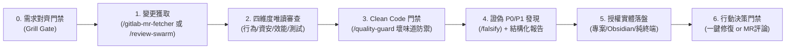

# 代碼與 MR 審查全自動流水線 (Review Flow)

本協議為「高品質代碼審查（Code Review）」的標準調度器。當使用者輸入 `/review-flow` 或提供 GitLab MR 連結 / 要求審核本地代碼時觸發。必須嚴格遵循階段門禁推進，**未經對齊拷問前禁止擅自假設報告儲存路徑**。

> 📂 **路徑變數**：`$OBSIDIAN_VAULT` 讀取環境變數。**未設定且使用者未提及筆記庫時，視為不使用 Obsidian：不得提供 Obsidian 落盤選項，也不得猜測或建立目錄。**使用者主動指定筆記庫路徑時以該路徑為準。

---

## 階段 0：需求對齊拷問門禁 (Grill Gate)

在深入審查程式碼與落盤報告前，**必須先啟動一輪結構化需求拷問**，確保審查面向與報告存放位置 100% 達成共識。

### 提問鐵律
1. **遵循 `grill-me` 提問規範**：每題附推薦答案、事實自查、決策才問（詳見下方連結區塊）。
2. **強制確認報告存放位置**：主動提供專案內、Obsidian 筆記庫、純對話框展示或直接產出 GitLab MR 留言等選項。**未經使用者確認授權前，絕對禁止在磁碟建立或修改任何檔案**。

> 🔗 **依 `grill-me`（`/grill-me`）協議提問**（格式、每輪上限、事實自查、共識確認皆以該協議為準）。以下是本 flow 的**必問題目**，作為初始決策前線；回答後若衍生新分支再依協議續問。

### 必問題目

1. **Q1 報告存放位置**（授權門禁：未確認前不得寫入任何檔案）：
   - 選項：專案內 `docs/reviews/<date>-<mr_or_branch>.md` ／ `$OBSIDIAN_VAULT/CodeReview/<date>-<mr_or_branch>.md` ／ 僅在對話框展示 ／ 產出可直接貼到 GitLab MR 的留言格式。
   - **Obsidian 選項僅在 `$OBSIDIAN_VAULT` 已設定或使用者提及筆記庫時才列出**，否則略過該選項。
   - 推薦：依當前情境，常用 Obsidian 或專案 `docs/`。
2. **Q2 審查重點與嚴格度**：
   - 選項：全維度平衡（行為回歸、資安、效能、Clean Code、測試）／ 阻斷性風險優先（僅聚焦 P0/P1、記憶體洩漏、資安漏洞）／ 架構設計與可讀性（模組職責、重構機會、代碼異味）。
   - 推薦：全維度平衡。
3. **Q3 後續行動**：發現可自動修復的重大問題時，是否由 AI 協助處理？
   - 選項：僅產出報告，維持唯讀 ／ 有明確修復建議時主動提示一鍵修復。
   - 推薦：僅產出報告，維持唯讀。

> ⚠️ **門禁約束**：等待使用者確認（使用者可直接回覆「全部依推薦」或修改個別選項）後，方可解鎖進入階段一。

---

## 階段一：變更範圍取證 (Diff Acquisition)

1. **判斷來源與拉取變更**：
   - 若使用者提供 GitLab MR 網址或 MR ID：自動啟動 `/gitlab-mr-fetcher`（`gitlab-mr-fetcher`）獲取 MR 標題、說明與完整變更 Diff。
   - 若為本地 Git 儲存庫：自動檢視暫存區與未暫存區變更（`git diff HEAD`）。
2. **範疇界定**：
   - 識別所有變更檔案的類別（UI 元件、業務邏輯、型別定義、測試檔案、配置檔）。

---

## 階段二：四維度唯讀審查 (Swarm Review - `/review-swarm`)

本階段**調度 `/review-swarm`（`review-swarm`）執行四維度審查**，並帶入 Q2 選定的嚴格度與重點；嚴格保持唯讀（絕不未經同意修改檔案）。下列為各維度的審查重點，供核對報告是否涵蓋，**不需在 `/review-swarm` 之外重複手動檢查**。若 `/review-swarm` 不可用，才由主控依下列四維度逐項人工審查：
1. **行為回歸（Behavioral Regressions）**：
   - 變更是否無意中破壞既有邏輯？邊界條件（null/undefined、空陣列、極值）是否妥善防護？
2. **資安與隱私（Security & Privacy）**：
   - 是否包含敏感資訊（API Token、密鑰）？是否存在 XSS、SQL/命令注入或未授權暴露的 API？
3. **效能與可靠性（Performance & Reliability）**：
   - 是否有不必要的重複渲染、記憶體洩漏風險或未釋放的監聽器？是否有未捕捉之 Promise 異常？
4. **測試覆蓋與契約（Test Coverage）**：
   - 關鍵業務邏輯變更有無對應的單元或整合測試？

---

## 階段三：Clean Code 與壞味道門禁 (Gate Check - `/quality-guard`)

使用代碼守護門禁標準對 Diff 進行深度過濾：
1. **命名與可讀性**：變數與函式命名是否言簡意賅且精確？是否有深層巢狀？
2. **不良實踐阻斷**：
   - ❌ **吞錯誤檢測**：檢查是否有空白 catch 區塊。
   - ❌ **殘留測試碼**：是否有遺留的 `console.log`、`debugger` 或臨時 Mock。
   - ❌ **過度設計與重複輪子**：是否呼叫了專案中既有的共用函式庫，而非重新實作？

---

## 階段四：結構化審查報告生成

**產出前先證偽**：對每一項 P0 / P1 發現調度 `/falsify` 嘗試推翻——是否為誤報？該風險是否已被其他層級防住（上游驗證、框架預設行為、既有測試）？無法確認者降級為 P2 並標註「待確認」；報告中註明哪些發現已通過證偽。

依據審查結果產出精確結構化內容，格式如下：

### 📋 審查概覽 (Review Summary)
- **審核目標**：[MR 連結 或 本地變更摘要]
- **風險評估**：`🟢 低風險` / `🟡 中風險` / `🔴 高風險`
- **門禁結論**：`✅ 建議合併 (LGTM)` / `⚠️ 建議修正後合併` / `❌ 阻斷合併`

### 🔍 發現之具體問題 (按嚴重度分級)
- **[P0 / 嚴重阻斷]**：[檔案路徑與行號] - 問題說明與修復建議
- **[P1 / 重大瑕疵]**：[檔案路徑與行號] - 問題說明與修復建議
- **[P2 / 建議改善]**：[檔案路徑與行號] - Clean Code 或可讀性建議
- **[P3 / 微小備忘]**：[檔案路徑與行號] - 命名風格或格式小建議

---

## 階段五：授權實體落盤 (Report Delivery)

依據**階段 0 Q1 使用者所選擇之存放位置**進行分流處理：
- **選項 1（專案內）**：寫入專案 `docs/reviews/<date>-<branch>.md`，並回報可點擊路徑。
- **選項 2（Obsidian 庫）**：寫入 `$OBSIDIAN_VAULT/CodeReview/<date>-<branch>.md`，並回報可點擊路徑。
- **選項 3（純終端）**：直接在對話框完整呈現，不建立任何實體檔案。
- **選項 4（GitLab MR 評論）**：整理為精簡 Markdown 留言格式，方便使用者直接複製貼至 MR 評論區。

---

## 階段六：行動決策門禁 (Action Gate)

報告輸出後，主動提供後續下一步選項，賦予使用者完全掌控權：

> 💡 **審查後續行動選項**：
> 1. **一鍵修復阻斷問題**：直接調用 `/implement` 自動修復上述 P0 / P1 問題。
> 2. **產出 GitLab MR 格式化評論**：生成可直接複製至 GitLab MR 的 Markdown Review 留言。
> 3. **無需動作**：僅供參考，維持現狀。
