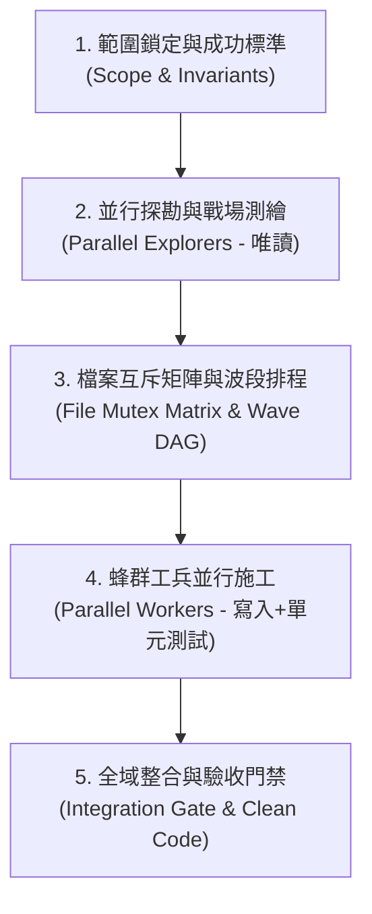

# Swarm Executor（全域多代理並行施工引擎）

> 「兵分多路，檔案互斥；就地驗收，零衝突交付。」
> 本協議為大規模代碼變更的**多代理協同施工引擎（Swarm Execution Engine）**。當重構、遷移或新功能開發涉及 5 個以上檔案或多個獨立子模組時，擺脫單一 Agent 記憶體耗盡與循序修改的漫長等待，調度多個專屬子代理（Subagents）在絕對安全的檔案鎖保護下高速並行施工。

---

## 觸發時機與快捷指令

### 觸發指令與模式
- **`/swarm-executor`**：通用蜂群施工（最常用）
- **新功能模式**：大規模新功能多模組並行實作
- **重構模式**：大規模重構與技術遷移專用

### 應主動啟動（符合任一條件）
- 重構或開發範圍橫跨多個獨立目錄或子系統（如同時修改 `features/auth`、`features/cart` 與 `shared/utils`）。
- 需修改檔案數預估超過 5 個，且模組間存在可切分的獨立邊界。
- 跨函式庫替換或批次型別升級（例如全面的 Vue 2 轉 Vue 3 SFC、Axios 換原生 Fetch）。

### 無需啟動（維持單兵作業）
- 僅修改 1~3 個檔案的局部小修改或 Bug 修復（直接使用 `/implement` 或 `/tdd`，避免 Subagent 的通訊開銷）。
- 高度耦合且必須循序推進的因果鏈修改（如單一函式內部的複雜演算法調整）。

---

## 核心執行流程（五階流水線）



---

### 第一階段：範圍鎖定與成功標準 (Scope & Invariants)

指揮官（主 Agent）首先明確本次任務的最高邊界，防止工兵過度發揮：
1. **目標路徑與範圍**：列出目標模組目錄，以及明確的**非目標（Non-goals）**。
2. **行為不變量（Invariants to Preserve）**：
   - 明列絕對禁止改動的對外行為、現有 API Signature 或邊界 Fallback。
3. **驗收度量**：明定整體完成標準（如 `npm run test` 全綠、`npm run typecheck` 零錯誤）。

---

### 第二階段：並行探勘與戰場測繪 (Parallel Exploration)

> ⚙️ **降級規則**：若當前 CLI 不支援 `invoke_subagent`（或同類子代理機制），改為**單線依序執行**——逐組探勘／逐維度審查，每組結論先存成暫存檔或貼在對話中，最後由主控彙整。結論品質不變，僅速度較慢。

指揮官呼叫 `invoke_subagent`，派出 2~4 個具備 `read-only` 權限的探勘兵（Explorer Subagent）分頭掃描不同目錄：

#### 探勘兵派工範本（Explorer Prompt）
```text
Role: Explorer
Prompt:
請針對目標目錄進行唯讀深度探勘，禁止修改任何檔案。
【目標範圍】：<目錄路徑或子模組>
【變更目標】：<重構 / 新功能 / 遷移目標>

請回傳：
1. 意圖現況（該模組目前負責什麼職責）
2. 外部相依性與耦合風險（被誰引用、依賴誰）
3. 候選工作封包清單（建議由單一工兵獨立處理的小單位）
4. 本模組的專屬驗證指令（如對應的單元測試指令）
```

---

### 第三階段：檔案互斥矩陣與波段排程 (Wave Scheduling)

指揮官收集所有探勘兵回報，合成唯一的**依賴有向無環圖（DAG）**，並強制建立**檔案互斥鎖（File Mutex Lock）**：

#### 檔案所有權鐵律（File Ownership Rules）
- **一檔一主**：同一個 Wave（波段）中，同一個檔案絕對只能由「單一工兵」持有修改權限。
- **嚴禁重疊**：若模組 A 與模組 B 都需要改動 `common.ts`，`common.ts` 必須被抽成獨立 Wave（先改或後改），不得在同一波並行。

#### 波段計畫表結構（Wave Plan Table）
```markdown
### Wave 1（葉節點，無相依，並行施工）
| 封包 ID | 工兵負責人 | 獨佔持有檔案路徑 (Owned Files) | 專屬驗收指令 |
| :--- | :--- | :--- | :--- |
| **WP-01** | Worker-Auth | `src/features/auth/**` | `npm test auth` |
| **WP-02** | Worker-Cart | `src/features/cart/**` | `npm test cart` |

### Wave 2（依賴 Wave 1 成果，後續施工）
| 封包 ID | 工兵負責人 | 獨佔持有檔案路徑 (Owned Files) | 專屬驗收指令 |
| :--- | :--- | :--- | :--- |
| **WP-03** | Worker-App | `src/App.vue`, `src/router/**` | `npm test router` |
```

---

### 第四階段：蜂群工兵並行施工 (Parallel Worker Execution)

針對當前 Wave 中的每個獨立封包，指揮官透過 `invoke_subagent` 同時召喚工兵（Worker Subagent）施工：

#### 工兵派工範本（Worker Prompt）
```text
Role: Worker (<封包ID>)
Prompt:
你正在與其他工兵同時施工，你並非唯一在 Codebase 中的 Agent。
【最高禁令】：
1. 嚴禁讀取或修改持有清單之外的任何檔案！忽略其他工兵的檔案變更。
2. 嚴禁執行 git commit 或 git push。

【任務詳情】：
- 封包 ID：<WP-ID>
- 目標說明：<精確修改目標>
- 獨佔檔案：<明確的檔案路徑清單>
- 必須保留的行為不變量：<不變量清單>
- 專屬驗證指令：<本模組單元測試指令>

【施工步調】：
1. 依據目標修改指定的獨佔檔案。
2. 執行專屬驗證指令，確保本模組單元測試全數 PASS。
3. 回報已修改檔案清單與驗證結果。
```

---

### 第五階段：全域整合與驗收門禁 (Integration Gate)

當同一個 Wave 的所有工兵完成回報後，指揮官執行全域驗收：
1. **全域編譯與型別檢查**：執行 `npm run typecheck` 或對應語言編譯器，確認 cross-module 介面契約完全閉合。
2. **全域測試套件**：執行專案完整測試（Unit + Integration）。
3. **Clean Code 守護門禁**：調用 `/quality-guard` 自行檢查代碼壞味道與殘留除錯碼。
4. **驗收成功推進**：若本波全綠，進入下一個 Wave；若全部 Wave 完成，向使用者交付完整成果報告！

---

## 資安防護與熔斷機制（Security & Safeguards）

1. **機密檔案讀寫禁令**：
   - 探勘兵與工兵皆嚴格禁止讀取或修改 `.env*`、私鑰憑證、Token 與各類機密配置檔。
2. **衝突熔斷機制（Conflict Circuit Breaker）**：
   - 若某工兵回報修改衝突或驗收指令連續失敗 2 次，指揮官立即中止該 Wave，回滾該工兵之改動並向人類使用者報告，嚴禁無休止盲目重試。
3. **提交權限隔離**：
   - 所有子代理一律不具備 Git 提交權限；所有修改必須經由全域整合門禁通過後，由主控指揮官產出報告，交由使用者授權後方可使用 `/commit-craft` 提交。

---

## 鐵則（Iron Rules）

1. **未出計畫，嚴禁開工**：在探勘完成並產出明確的「檔案互斥矩陣」前，絕對禁止指派工兵修改任何程式碼。
2. **跨界修改即刻懲罰**：工兵只要觸碰了所屬封包以外的檔案，該次修改視為無效並立刻回滾。
3. **單元不綠，不進全域**：單一工兵未在自己的沙盒中跑過專屬驗收指令前，指揮官不得將其標記為完成。
